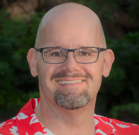
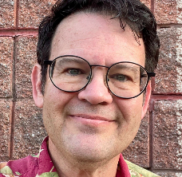

# AI Fluency: Framework & Foundations
*Learn to collaborate with wAI systems effectively, efficiently, ethically, and safely*

Course Link: [AI Fluency Framework Foundations](https://anthropic.skilljar.com/ai-fluency-framework-foundations)

## About this course

At Anthropic, we believe that empowering people with AI, and ensuring that AI makes safe contributions to society, requires engaging with a wide range of human perspectives and experiences. Responsible AI development and engagement isn't something any single discipline or viewpoint can fully address. It demands collaborative approaches that span a wide range of technical, creative, business, scientific, and educational domains. That's why we partnered with educators who bring complementary expertise to create this foundational course on AI collaboration.

This course is the result of a long partnership between Anthropic and professors Rick Dakan from Ringling College of Art and Design and Joseph Feller from University College Cork. Rick and Joe developed the AI Fluency Framework in 2023-2024, based on their research exploring how AI tools like Claude were transforming creative and business processes. When we saw the framework, we immediately recognized a shared vision: helping people interact with AI effectively and responsibly, beyond just “cool prompts.” Their framework offered exactly the kind of multidisciplinary perspective we believe is essential for navigating AI’s impact on society.

The AI Fluency Framework they created — four interconnected competencies (Delegation, Description, Discernment, and Diligence) — enables more effective, efficient, ethical, and safe human-AI collaboration, regardless of which new AI models or tools emerge. We collaborated to develop this course based on their framework, bringing together our collective expertise in AI systems, education, creativity, and business innovation. The work was supported in part by the Higher Education Authority (Ireland) through the National Forum for the Enhancement of Teaching and Learning.

This framework has already informed undergraduate and postgraduate courses at both Ringling College and University College Cork, as well as staff training initiatives and community outreach events. Now, we’re excited to share these insights more broadly through this open online course.

Our goal is to make AI Fluency accessible and useful to everyone, no matter what stage of AI expertise you find yourself at. We hope you find it valuable in navigating the evolving landscape of AI collaboration.

## Course Sections

### AI Fundamentals & Framework (10 lessons)

Establish foundational understanding of generative AI systems and why developing AI fluency matters for effective collaboration. Introduces the 4D Framework as a structured approach to human-AI interaction, covering core capabilities and limitations of current AI technologies. Provides the conceptual grounding needed to approach AI tools strategically rather than reactively.

### Practical AI Skills (10 lessons)

Develop hands-on competencies for effective AI collaboration through the four core areas of the framework: delegation, description, discernment, and diligence. Learn systematic approaches to project planning with AI, crafting effective prompts, evaluating outputs critically, and iterating through the description-discernment loop. Emphasizes practical application across creative, business, and educational contexts.

## About Instructors

<table>
  <tr>
    <td width="180">
      
    </td>
    <td>
      <strong>Drew Bent</strong> leads education research at Anthropic. He previously co-founded the tutoring non-profit Schoolhouse.world with Sal Khan, which he ran from 2020-24 and now sits on the board. Prior to that, he wrote code at Khan Academy, taught high school math, and has been tutoring students for over a decade. Drew has degrees in physics & CS from MIT, and an education master's from Stanford.
    </td>
  </tr>
  <tr>
    <td width="180">
      
    </td>
    <td>
      <strong>Rick Dakan</strong> Rick is the AI Coordinator and a professor at Ringling College of Art and Design in Sarasota, Florida where he teaches creative writing, interactive experience design, and AI courses. He also oversees the college's Undergraduate Certificate in Artificial Intelligence and the Professional Certificate in Fundamentals of AI for Creatives. He is a game designer and author of more than thirty games and books from video games and tabletop games to novels, nonfiction, and comics.
    </td>
  </tr>
  <tr>
    <td width="180">
      
    </td>
    <td>
      <strong>Joseph Feller</strong> is Professor of Information Systems and Digital Transformation at the Cork University Business School, University College Cork, Ireland. His current work focuses on AI-human hybrid creativity, innovation, and learning. His research has been published in Information Systems Research, Journal of MIS, Journal of the AIS, Journal of Information Technology, Information Systems Journal, European Journal of Information Systems, and Journal of Strategic Information Systems, and has been funded by the European Commission, Irish Research Council, Irish HEA, and other funding bodies.
    </td>
  </tr>
  <tr>
    <td width="180">
      
    </td>
    <td>
      <strong>Maggie Vo</strong>  founded and leads Anthropic's education team. She has a varied applied research background from Harvard University, with a career and education that spans fields such as game design, organizational behavior, tech and consumer goods, and human behavioral psychology. Maggie has held previous roles at top consulting firms and innovative startups alike. Prior to Anthropic, she worked in AI strategy consulting.
    </td>
  </tr>
</table>

## AI diligence statement

In the development of the AI Fluency: Framework and Foundations course, we engaged in extensive collaboration with Claude 3.7 from Anthropic.

The base content for this course came from:

- The AI Fluency Framework Practical Summary Document by Rick Dakan (at Ringling College of Art and Design) and Joseph Feller (at University College Cork) and related working documents and research notes

- Slide decks and lecture transcripts from multiple university courses, guest lectures, and research talks delivered by Feller and/or Dakan

- Technical/practical content provided by Maggie Vo and Drew Bent (Anthropic)

Throughout this process, Claude assisted one or more of the human authors with structural development, resource and exercise design, and content drafting, critiquing, editing and rewriting. The human authors wrote, designed, edited and provided continual vision, expertise, critical judgment, and domain knowledge and made all final decisions about both content and approach.

All AI-generated and co-created content underwent thorough validation, editing, and curation by the human authors. The final materials accurately reflect the human authors' understanding, expertise, and intended pedagogical approach. While AI assistance was instrumental in producing these materials, the human authors maintain responsibility for the content.

This disclosure is made in the spirit of transparency advocated by the AI Fluency Framework and to acknowledge the evolving role of AI in educational content development and other creative and intellectual work.