# Building with the Claude API

This comprehensive course covers the full spectrum of working with Anthropic models using the Claude API.

Course Link: [Course Overview](https://anthropic.skilljar.com/claude-with-the-anthropic-api)

## About this course

This course provides comprehensive coverage of the Claude API, from basic usage through advanced agent architectures. You'll learn to integrate Claude into applications, implement tool calling, build RAG pipelines, and design both deterministic workflows and flexible agent systems.

**Learning objectives**

By the end of this course, you'll be able to:

- Make API requests to Claude models and handle responses
- Implement multi-turn conversations, streaming, and structured output generation
- Build and evaluate prompts systematically using automated testing pipelines
- Create custom tools and integrate Claude with external services
- Design and implement RAG systems with hybrid search and reranking
- Use MCP (Model Context Protocol) to connect Claude to various data sources
- Understand common workflows and agent architecture

**Prerequisites**

- Proficiency in Python programming
- Basic knowledge of handling JSON data
- Access to an Anthropic API key

**Who this course is for**

Software engineers who need to integrate Claude into production applications. Whether you're building chatbots, automation tools, or AI-powered features, this course covers the implementation patterns you'll need.

## Course sections

### 1. Getting started with Claude

> *16 lessons*

Start here for the fundamentals. Covers API authentication, basic requests, conversation management, system prompts, and structured output generation.

> Course Preview Images

  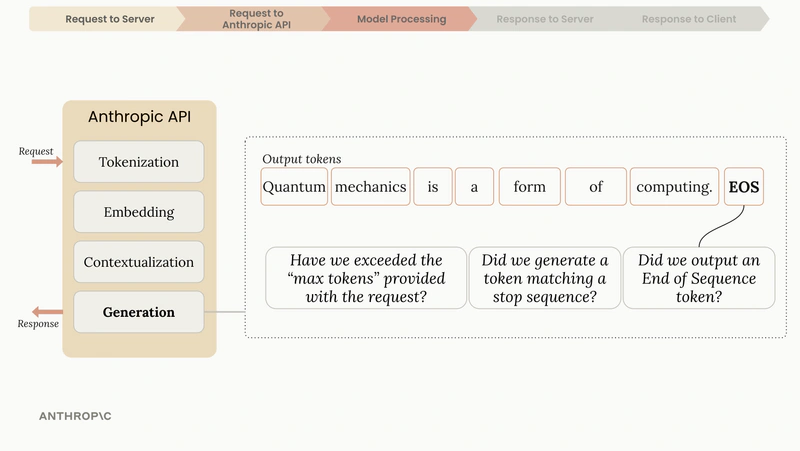
  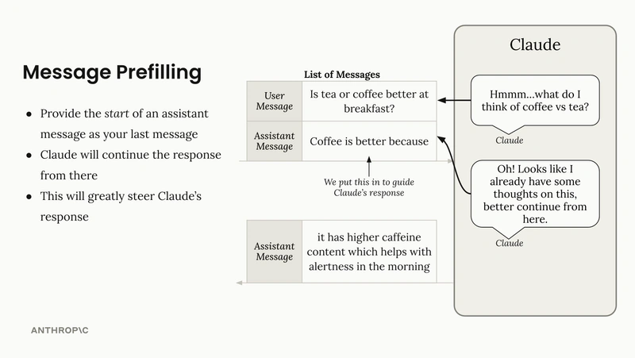
  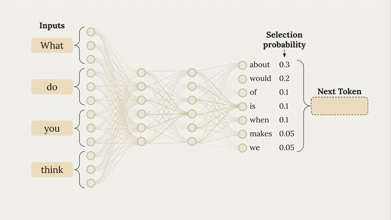

### 2. Prompt Engineering & Evaluation

> *16 lessons*

Learn to write prompts that actually work. Focuses on prompting strategies, evaluation frameworks, and systematic testing approaches.

> Course preview images

  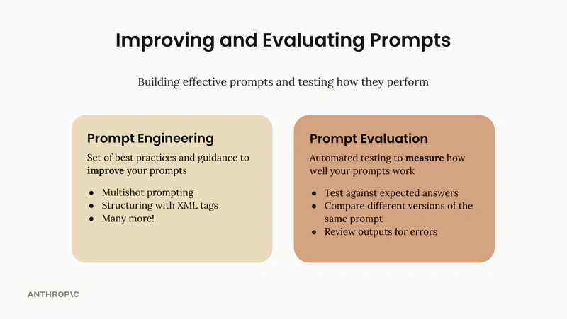
  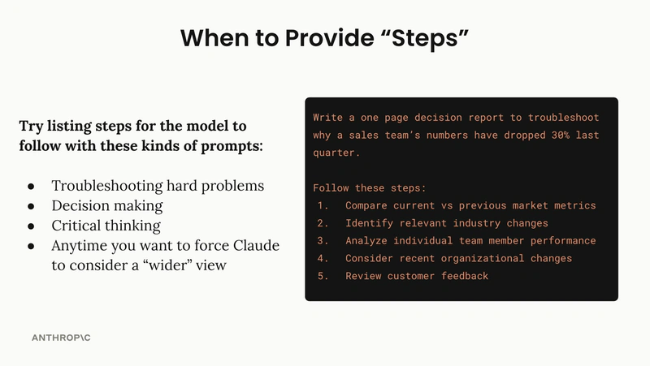
  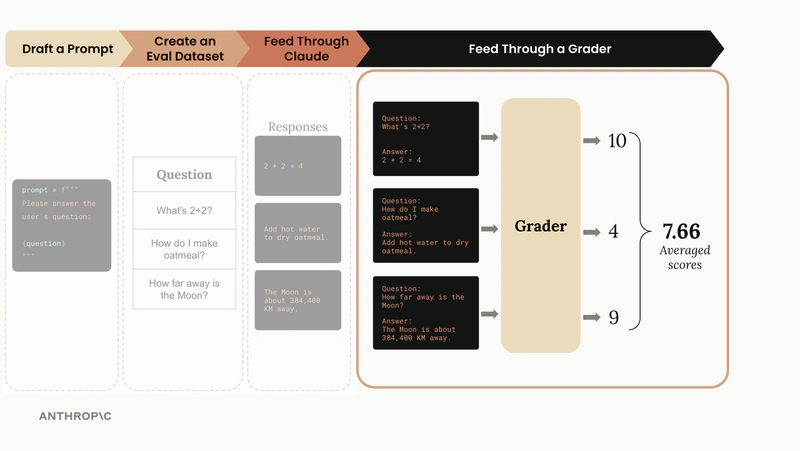

### 3. Tool use with Claude

> *14 lessons*

Extend Claude with custom tools and functions. Build apps with function calling, multi-turn tool interactions, batch tool calling, and leverage built-in utilities.

> Course Preview Images

  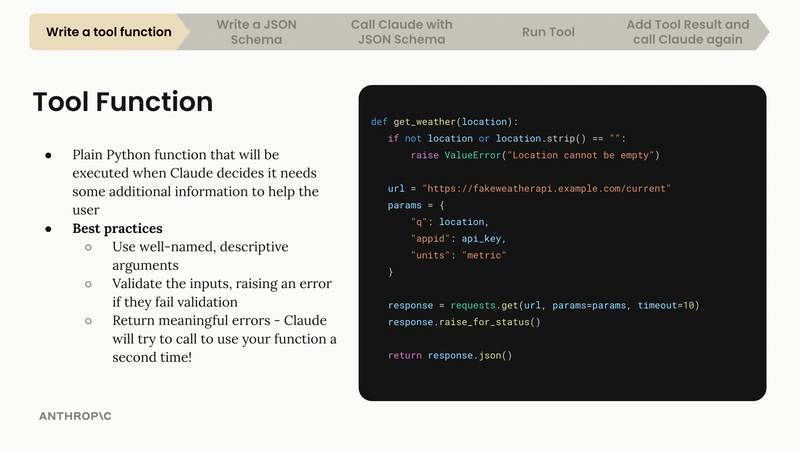
  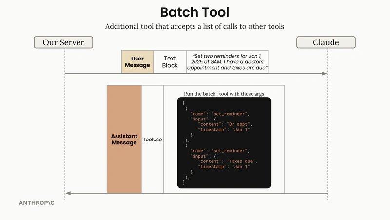
  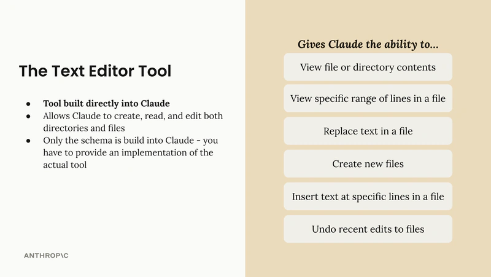

### 4. Retrieval-Augmented Generation

> *10 lessons*

Implementation guide for production RAG systems. Covers text chunking, embeddings, hybrid search with BM25, multi-index architectures, reranking, and contextual retrieval.

> Course Preview Images

  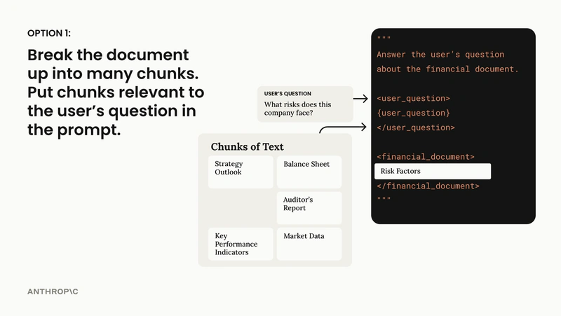
  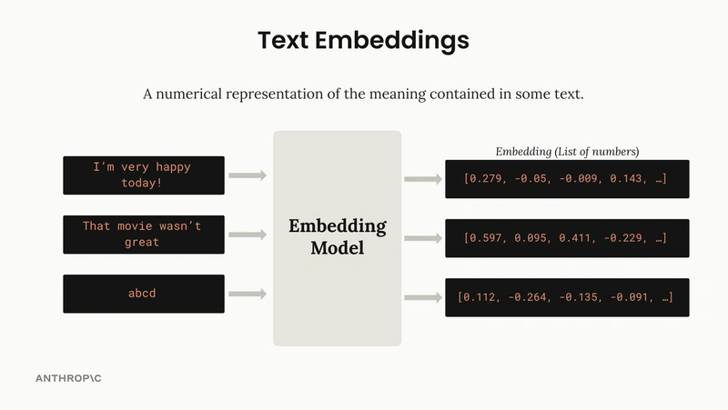
  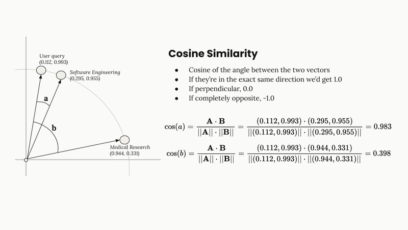

### 5. Model Context Protocol (MCP)

> *12 lessons*

The protocol for building modular AI applications. Define custom tools and resources, implement MCP servers and clients, handle the full integration lifecycle.

> Course Preview Images

  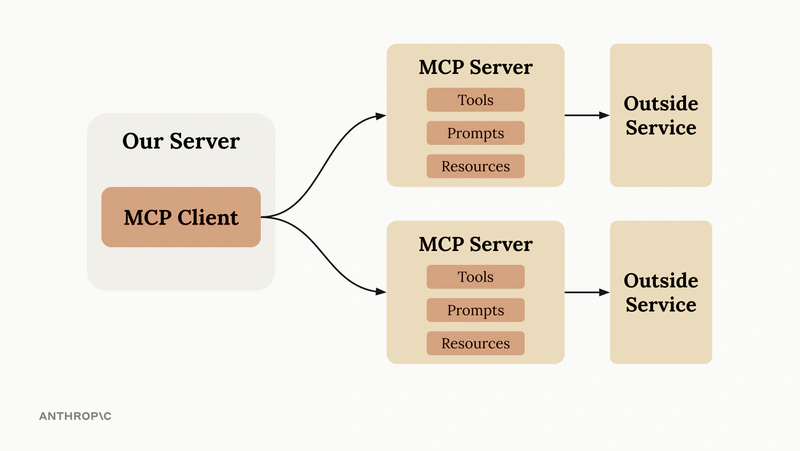
  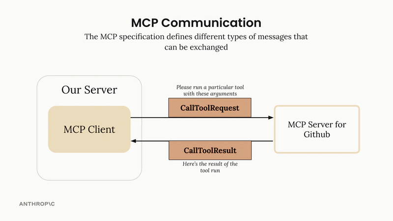
  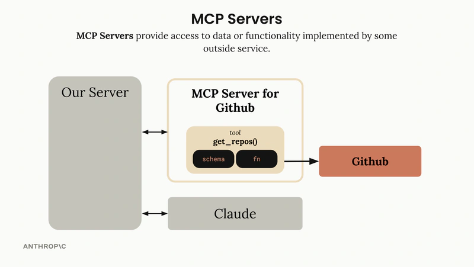

### 6. Claude Code & Computer Use

> *8 lessons*

Two powerful Anthropic tools in action. Claude Code accelerates development workflows, Computer Use automates UI interactions. Includes MCP integration patterns.

> Course Preview Images

  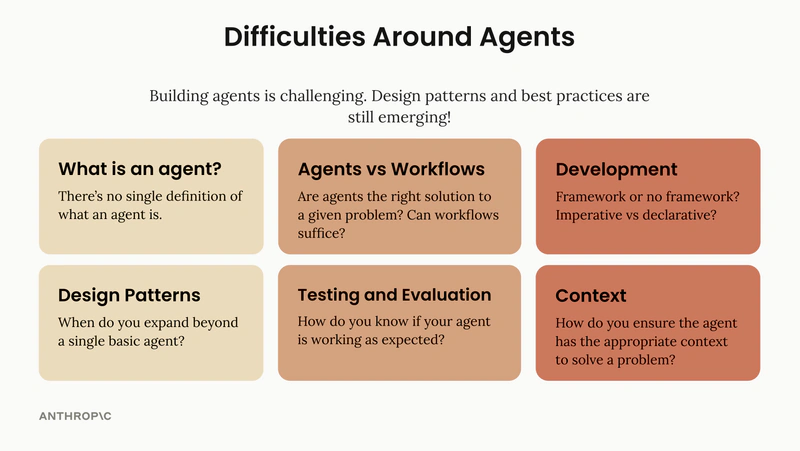
  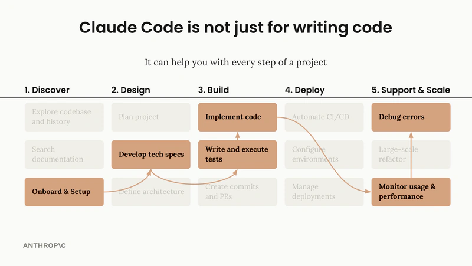
  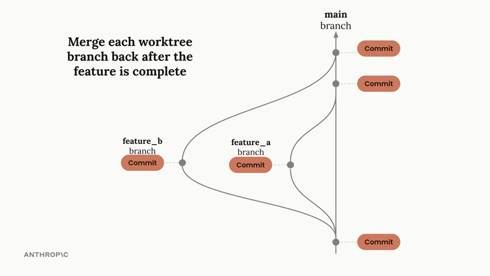

### 7. Agents and workflows

> *11 lessons*

Architecture patterns for autonomous AI systems. Understand parallel execution, operation chaining, conditional routing, and effective debugging strategies.

> Course preview images

  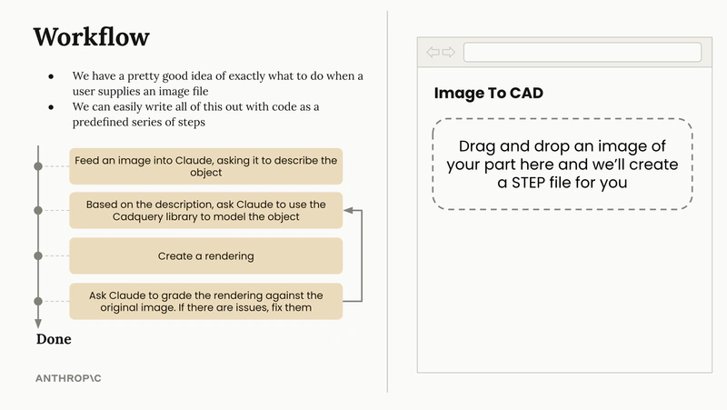
  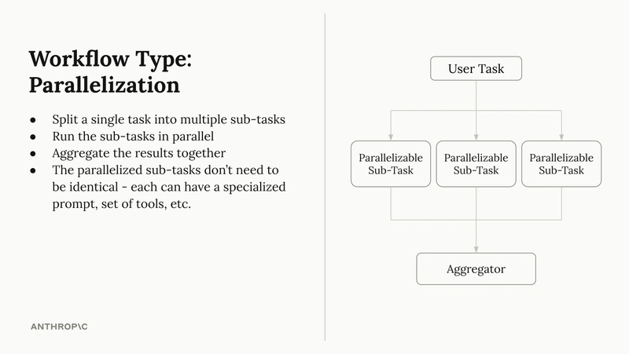
  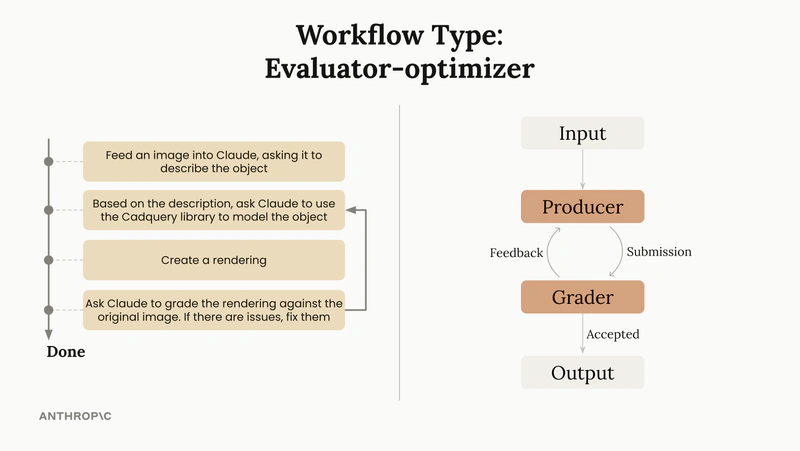

