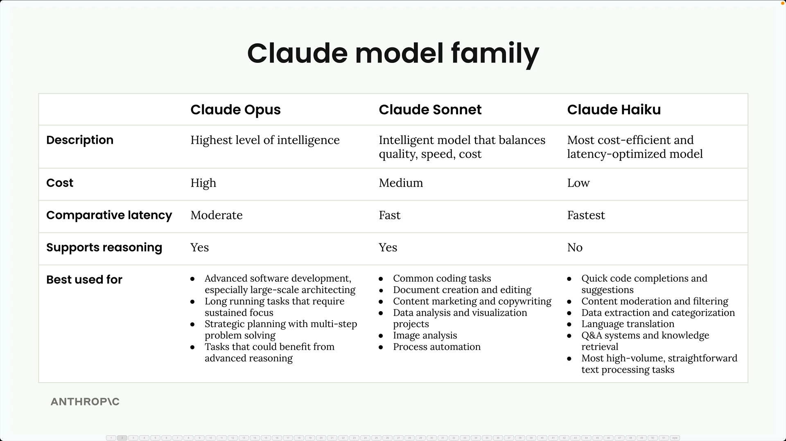
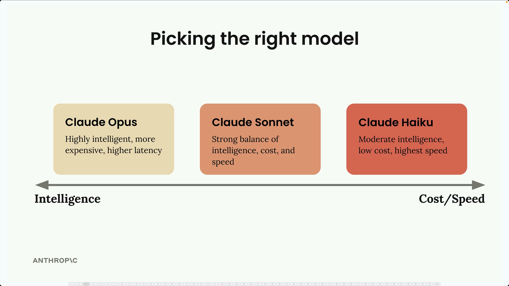

# Overview of Claude Models

Claude has three model families, each optimized for different priorities.

> Video Link: [Overview of Claude Models](https://anthropic.skilljar.com/claude-with-the-anthropic-api/287818)

## The Three Families

| Model | Optimized For | Trade-off |
|---|---|---|
| **Opus** | Highest intelligence — complex, multi-step tasks requiring deep reasoning and planning | Higher cost and latency |
| **Sonnet** | Balanced intelligence, speed, and cost efficiency; strong coding and precise code editing | Best all-around choice for most use cases |
| **Haiku** | Speed and cost efficiency; no extended reasoning like Opus/Sonnet | Best for real-time interactions and high-volume processing |

---

## Selection Framework

- **Intelligence is the priority** → choose Opus
- **Speed is the priority** → choose Haiku
- **Balanced requirements** → choose Sonnet

---

## Common Approach

Rather than picking a single model for an entire application, a common pattern is to **use multiple models within the same app**, matching each task to the model best suited for it.

## Shared Capabilities

All models share the same core capabilities:
- Text generation
- Coding
- Image analysis

The main difference between them is their **optimization focus**, not what they can fundamentally do.
